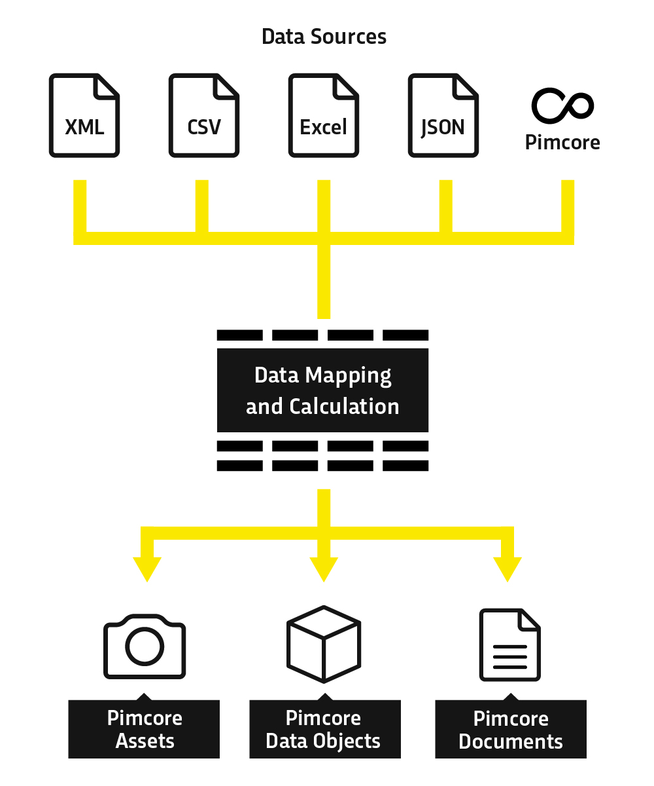
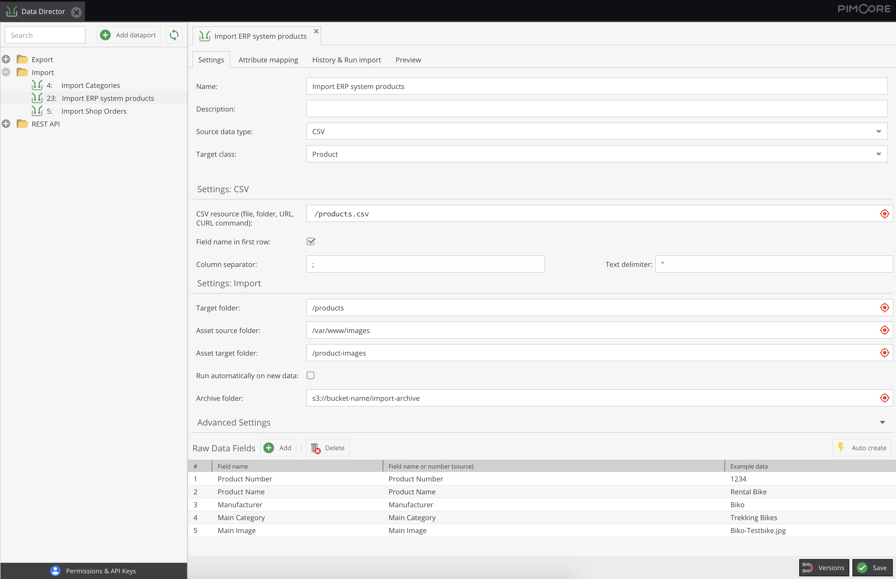
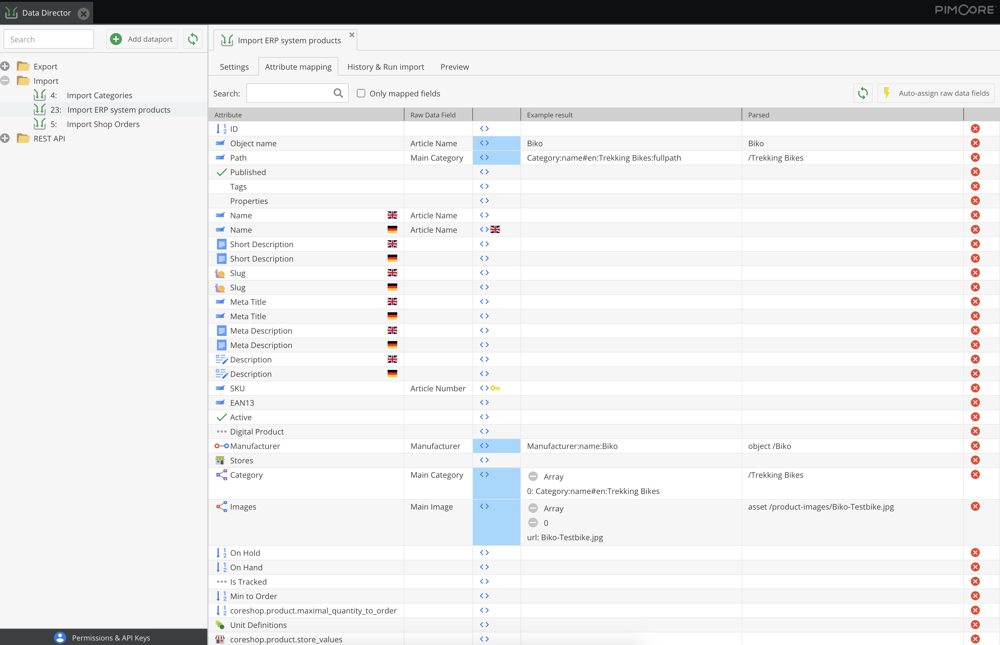

# Pimcore Import Plugin

Feature-rich import bundle to connect external systems to Pimcore

* * *

## What does this plugin do?

This plugin imports data from external XML, JSON, CSV, Excel data sources (for example from an ERP system), stores them to an intermediate raw data table, and then assigns them to your data objects, assets and documents.

In the Pimcore backend GUI you can define which data is to be extracted from the import source and assign it to the object fields of your Pimcore objects. All Pimcore data types are supported for import. Also the import of assets and documents is possible (including editing metadata, tags etc.).

During the import, data can be modified and adapted to your data model. This plug-in provides extensive functionality and a convenient user interface and is a battle-tested solution for importing structured data into Pimcore objects, assets and documents. It reduces the effort of programming individual interfaces and reduces the time to commissioning your Pimcore project.

You can also watch the whole process in a 
[video](https://youtu.be/O6nsshkOEPU).

## How to get the plugin

You can buy this plugin in the [Blackbit Shop](https://shop.blackbit.de/de/pimcore-modul-bb-import).

* * *

## Advantages over own import implementation

* Performance:
  * Data is only imported if nothing has changed since the last import
  * If an object has not changed during import, it does not need to be saved
* Flexibility:
  * Imports are customizable to data source and your Pimcore data model
  * Supports all Pimcore objects including data objects, object bricks, field collections, assets and documents
* Minimization of programming effort: Only data modifications from the data source require minimal programming
* Comfort functions: e.g. Optimizing inheritance, reverting imports, replacing placeholders
     
* * *

## Workflow

### Step 1: Import XML, Excel and CSV into Pimcore

This plugin has proven itself in many e-commerce and master data management projects and has been developed according to the needs of our customers.

The aim of the plug-in is to import information from upstream systems into the objects of Pimcore, there appropriately enrich them with further information and publish them via Pimcore itself or via a downstream system such as an online shop.

The import always takes place in two steps: In the first step, an intuitive user interface determines which columns of a CSV file or which attributes of an XML / JSON document should be imported into Pimcore.

A preview shows directly if the raw data fields are set up correctly. The import reads the data into an "intermediate table" so the user can see which data was imported from the upstream system before it is further processed in the next step.

### Step 2: Mapping Attributes via Drag-and-Drop

In the second step, the information from the intermediate table is assigned to the attributes of the classes. Thise mappings get individually defined in the Pimcore backend UI via drag-and-drop.

There one or more key attributes get set so that the import process can be repeated and existing objects get updated.

The attribute mapping can also be used to modify the source data. For each field assignment, a callback function can be specified, which, for example, performs date format operations or other calculations on the basis of one or multiple imported or existing attributes of the current object.

* * *

## Further highlights at a glance

* File-based imports (monitoring of a directory and automatic import on new files), for example for:
  * automatic asset imports into the Pimcore (e.g. from a network drive)
  * automatic mapping of assets to Pimcore objects by file name
* Import multiple files (CSV, XML, JSON, Excel) from a source directory with automatic dataset deduplication
* Import from a URL as a data source
* Import data from Pimcore objects:
  * Migrate data from one field type to another without data loss
  * dynamic mass data manipulation (currently that is not possible in the Pimcore grid (for example, increase prices by 10%))
* Import of documents (filling of the editables)
* Skipping records from the import source, e.g. if data is missing or the quality is insufficient
* easy import of relations
* Import of object hierarchies / object trees
  * Specification of the parent element possible
  * Option to optimize inheritance (data is entered as high as possible in the object hierarchy)
* Automatic translation of texts via translation providers (via DeepL or AWS API)
* Support of all Pimcore data types including relations with metadata, object bricks, field collections etc.
* optimized performance:
  * If the source data has not changed, the import of the data record can be skipped
  * If data of an object is not changed in the import, it does not need to be saved
* Possibility to revert imports:
  * If an attribute assignment error has crept in and several thousand objects have been filled with incorrect data, the change can be reverted - in this case only the fields mapped in the import are set back, only for the objects changed in the import - a big advantage over a complete backup restore

## Documentation

To learn more about all options and how they can be configured, please [read the full documentation](https://pimcore.blackbit.de/Blackbit/1.pimcore/Handb%C3%BCcher/Ultima-Import-Bundle.pdf).